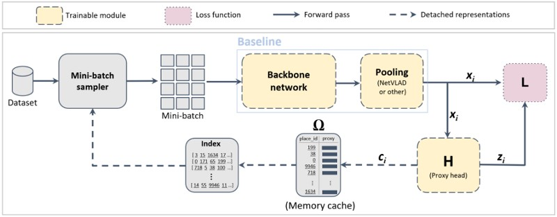
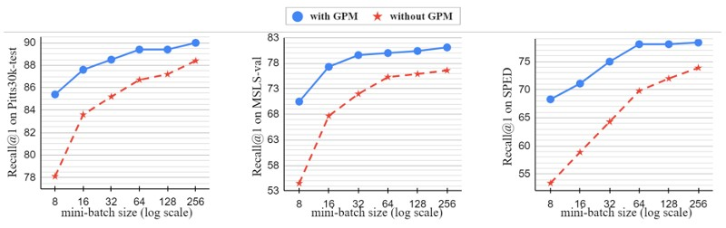

# Global Proxy-based Hard Mining for Visual Place Recognition

Official repository for BMVC 2022 paper: **Global Proxy-based Hard Mining for Visual Place Recognition**

[[Video](https://bmvc2022.mpi-inf.mpg.de/958/)] [[ArXiv](https://arxiv.org/abs/2302.14217)] [[PDF](https://bmvc2022.mpi-inf.mpg.de/0958.pdf)]

### **Summary**

This paper introduces a novel approach to deep representation learning for Visual Place Recognition. Our method utilizes global hard mini-batch sampling based on proxies, achieved by adding an end-to-end trainable branch to the network that generates efficient place descriptors. These descriptors are then used to construct a global index that captures the similarities between all places in the dataset, enabling highly informative mini-batch sampling at each training iteration. The proposed technique can be used with existing pairwise and triplet loss functions at minimal additional memory and computation cost.



---

### Performance introduced by GPM

GPM is effective for a wide range of mini-batch sizes, with more impact when smaller mini-batches are used for training. This is of great importance when training hardware resources are limited.



Code coming soon


# Cite

Use the following bibtex code to cite our paper

```
@inproceedings{Ali-Bey_2022_BMVC,
author    = {Amar Ali-Bey and Brahim Chaib-draa and Philippe Giguere},
title     = {Global Proxy-based Hard Mining for Visual Place Recognition},
booktitle = {33rd British Machine Vision Conference 2022, {BMVC} 2022, London, UK, November 21-24, 2022},
publisher = {{BMVA} Press},
year      = {2022},
url       = {https://bmvc2022.mpi-inf.mpg.de/0958.pdf}
}
```
